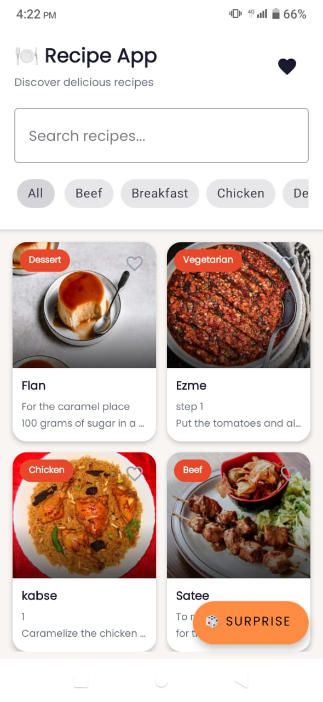
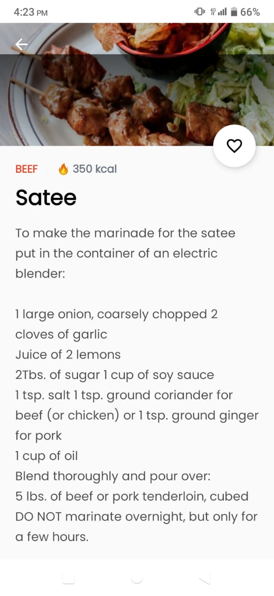
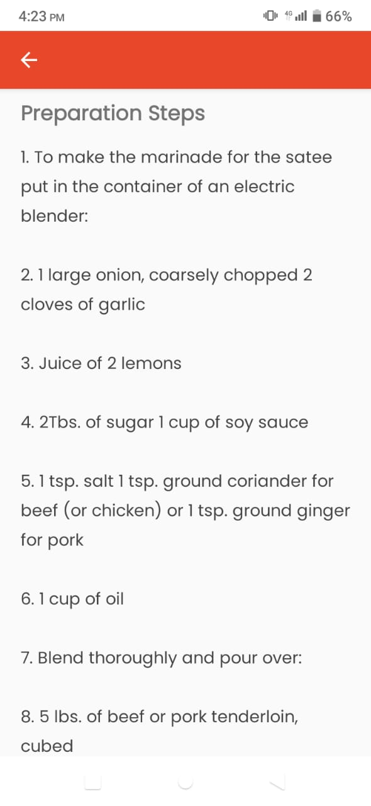
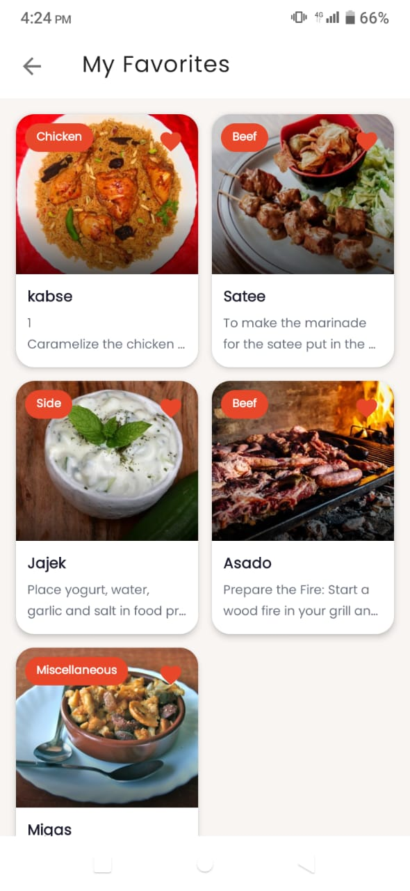
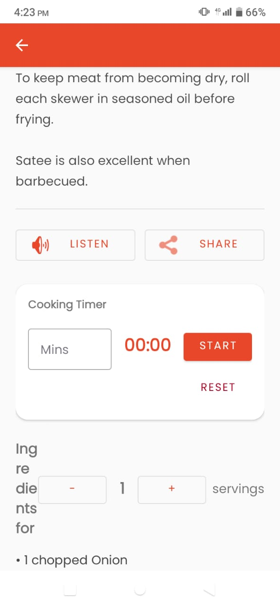

# 🍳 CookMate — Android Recipe App

CookMate is a modern Android recipe application built with **Kotlin** in **Android Studio**. It helps users discover delicious recipes, search meals, view detailed cooking instructions, save favorites, and enjoy a smooth cooking experience with features like a built-in cooking timer, servings calculator, and random recipe generator.

---

## 📱 Features

- 🍽 Browse a variety of recipes
- 🔍 Instant recipe search
- ❤️ Add and remove favorite recipes
- 📖 Detailed recipe information
- 🥘 Ingredient lists
- 👨‍🍳 Step-by-step cooking instructions
- 🎲 Surprise Me (random recipe generator)
- 📤 Share recipes with friends and family
- 🍽 Servings calculator
- ⏲️ Built-in cooking timer
- 🖼 High-quality recipe images
- 🌐 API integration for recipe data
- 🎨 Clean, modern Material Design UI

---

## 🛠 Technologies Used

- Kotlin
- Android Studio
- RecyclerView
- Glide
- REST API
- Firebase
- Material Design Components

---


## 📸 Screenshots

| Home Screen | Recipe Details |
|--------------|----------------|
|  |  |

| Preparation Steps | Favorites |
|-------------------|-----------|
|  |  |

| Cooking Timer |
|---------------|
|  |

---

## 🚀 Installation

1. Clone the repository:
   ```bash
   git clone https://github.com/shamtarar02-lgtm/RecipeApp-Kotlin.git
   ```
2. Open the project in Android Studio.
3. Sync Gradle dependencies.
4. Run the application on an Android emulator or a physical device.

---

## 🎯 Future Improvements

- 🌙 Dark Mode
- 🎤 Voice Search
- 🛒 Shopping List
- 📅 Meal Planner
- 📶 Offline Support
- 🔔 Recipe Notifications

---

## 👩‍💻 Developer

**Kinza Mukhtar**
IT Student | Android & Kotlin Developer

### Skills
- Kotlin
- Android Development
- Firebase
- REST API Integration
- RecyclerView
- Glide
- Material Design
- Git & GitHub
- Figma
- Docker
- WordPress

---

## ⭐ Support

If you like this project, please consider giving it a ⭐ on GitHub.
Thank you for visiting my repository!
